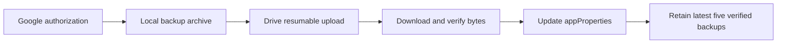

# How Google Drive Backup Works

**Due to the Google Drive API user policy, this backup option is currently disabled.** Google Drive authorization and storage adapters remain in the source code, but Valnook 0.0.15 does not expose a Google Drive backup entry point or wire these adapters into its active cloud backup service. The current provider is [OneDrive](ONEDRIVE_BACKUP.md).

This document describes the retained Google Drive implementation and its backup workflow. Its presence does not mean that Google Drive sign-in, automatic backups, or cloud restoration are available in the current app.

## Platforms and components

| Component | Role in the retained integration |
| --- | --- |
| Android app | Creates archives, requests authorization, and runs backup and restore operations. |
| Google Cloud / Google Auth Platform | Provides the project, Drive API enablement, OAuth application configuration, and consent setup. |
| Google Identity Services through Google Play services | Provides Android `AuthorizationClient` and account consent. |
| Google Drive API v3 | Provides account display information, file storage, listing, downloading, and trash operations. |
| Shared Valnook backup coordinator | Implements archive preparation, verification, retention, and restore staging. |
| Android WorkManager | Provides the scheduling mechanism used by the cloud backup workflow; the current production scheduler is connected to OneDrive. |

Files travel directly between the Android device and Google Drive over HTTPS. This integration does not use a Valnook-operated relay server, Firebase, Gmail, or the LAN web-management page for cloud authorization.

An Android OAuth configuration associates an application package and signing identity with a Google Cloud project. This document does not publish project identifiers, OAuth client identifiers, certificate fingerprints, signing files, or credentials. Google's [Android authorization documentation](https://developer.android.com/identity/authorization) describes the platform setup and consent flow.

## Authorization and permission

The retained gateway requests only `https://www.googleapis.com/auth/drive.file`. This scope permits access to files created by the app or specifically authorized for it; it is not general access to every file in the drive. See Google's [Drive scope reference](https://developers.google.com/workspace/drive/api/guides/api-specific-auth).

- Obtain an `AuthorizationClient` with `Identity.getAuthorizationClient`.
- Call `authorize` with an `AuthorizationRequest` containing the Drive file scope.
- If Google requires user interaction, return its pending intent to the Android UI and read the result with `getAuthorizationResultFromIntent`.
- Pass the resulting short-lived access token to the backup coordinator. Application business code does not save that token in financial records or backup archives.
- For subsequent access, request authorization for the already connected Google account. If a resolution is required, report that foreground authorization is needed instead of attempting background interaction.
- The gateway also provides `revokeAccess` for the selected account and scope. This is retained SDK functionality, not a currently exposed Google Drive setting.

The adapter reads the user's display name and email through Drive's `about.get` API; it does not call a separate Gmail or People API.

## Folder and archive layout

The adapter searches for a non-trashed folder marked with private application properties `app=valnook` and `role=backup-root`. It follows pagination and chooses the oldest matching folder deterministically. If none exists, it creates `Valnook_backup`.

This is a regular folder in the Drive `drive` space, not the hidden `appDataFolder`. The visible folder name alone is not the ownership check.

```text
Google Drive/
  Valnook_backup/
    {backup-file-name}.val_backup
```

Each archive stores backup identity, attempt identity, checksum, snapshot time, format and producer versions, and verification state in Drive `appProperties`. Unlike OneDrive, this adapter does not create a separate `metadata.json` for each archive. Google documents these properties in its [custom file properties guide](https://developers.google.com/workspace/drive/api/guides/properties).

## Backup workflow



- **Connect:** After authorization, read account display information and resolve or create the marked backup folder. The shared coordinator records the provider, account reference, and folder reference locally.
- **Prepare:** Check the active session, network, and trusted time. Create the same `.val_backup` snapshot used for local backup in private temporary storage. Record the backup identifier, attempt identifier, byte count, and checksums.
- **Start upload:** Send file metadata, parent folder, and application properties to Drive's resumable-upload endpoint. Receive an upload-session URL in the `Location` response header.
- **Send bytes:** Upload sequential chunks of 8 MiB with `Content-Range`, using a smaller final chunk if needed. A `308` response indicates that upload remains incomplete; the final success response supplies the file metadata. This uses the [Drive resumable-upload protocol](https://developers.google.com/workspace/drive/api/guides/manage-uploads).
- **Verify:** In the shared coordinator, check the returned file identity and archive metadata, then download the bytes and compare their SHA-256 and size with the local archive. A remote verification flag alone is not sufficient proof.
- **Mark success:** Update the file's `appProperties` to mark it verified and reread its metadata.
- **Retain backups:** After a verified success, the shared policy keeps the five newest verified managed backups. The Google adapter moves older eligible files to Trash using `trashed=true`; it does not permanently delete them with a file-delete request.

The adapter uses a resumable-upload transport, but it does not persist the upload-session URL and offset for arbitrary process-restart continuation. The shared coordinator separately records uncertain outcomes and can locate and verify an already completed upload using its attempt identity. These are different mechanisms.

## APIs called

Drive metadata paths below are relative to `https://www.googleapis.com/drive/v3`. Braced names are placeholders.

| Method and endpoint | Purpose |
| --- | --- |
| `GET /about?fields=user(displayName,emailAddress)` | Obtain connected-account display information. |
| `GET /about?fields=kind` | Obtain the HTTPS response `Date` header when Android network time is unavailable. |
| `GET /files?q={query}&spaces=drive&pageSize=100&orderBy=createdTime,name&fields={fields}` | Find the marked backup folder or list files under it. Subsequent requests include `pageToken`. |
| `POST /files?fields={fields}` | Create a regular folder with the app's ownership properties. |
| `POST https://www.googleapis.com/upload/drive/v3/files?uploadType=resumable&fields={fields}` | Start an archive upload with its name, parent, and properties. |
| `PUT {session-url}` | Upload archive chunks using the returned session URL. |
| `GET /files/{file-id}?fields={fields}` | Read identity, name, creation time, size, MD5, parents, properties, and trash state. |
| `PATCH /files/{file-id}?fields={fields}` | Update verification properties. |
| `GET /files/{file-id}?alt=media` | Download archive bytes for verification, saving, or restore staging. |
| `PATCH /files/{file-id}?fields=id` with `trashed=true` | Move an older eligible backup to Trash. |

The selected metadata fields are `id`, `name`, `createdTime`, `size`, `md5Checksum`, `parents`, `appProperties`, `trashed`, and `mimeType`. Listing also requests `nextPageToken`. The app uses its small HTTP adapter rather than the Google Drive Java client library. API definitions are available in the [Drive v3 reference](https://developers.google.com/workspace/drive/api/reference/rest/v3).

## Restore, scheduling, and disconnect behavior

The retained adapter implements cloud storage operations. Archive validation, scheduling policy, and transactional restoration belong to the shared backup infrastructure:

- **Restore:** Check that the selected file is a managed, compatible backup; download it to private staging storage; verify size and SHA-256; validate the archive and record relationships; show a preview and require overwrite confirmation. Successful import replaces the portable local dataset in a transaction. It does not merge ledgers.
- **Failure:** Invalid archives and rolled-back restores leave existing data intact. A lost upload response is recorded as an uncertain outcome rather than automatically being treated as a missing remote file.
- **Schedule:** The shared policy defaults to a 24-hour interval and accepts 1–720 hours. It uses network-constrained WorkManager jobs, checks stale session generations, and pauses after successful restoration. These policies do not create an active Google Drive schedule in the current app.
- **Disconnect:** Clearing a local connection cancels future work and leaves remote files in place. The retained Google gateway can separately revoke the app's scoped authorization through `AuthorizationClient.revokeAccess`; revocation is not a request to delete the stored backups.

Changing the active provider to OneDrive does not copy Google Drive files into OneDrive or connect to both providers simultaneously. An existing compatible `.val_backup` file obtained from Google Drive can be selected through the app's local restore flow and goes through the same validation and overwrite confirmation.

## Data and privacy boundaries

The shared archive format includes supported financial records, account icons, wallet fronts, card links, ordering, and portable settings. It excludes authentication tokens, SDK authentication caches, Keystore keys, and all private card-back fields, back/edge colors, encrypted vault files, and local-only associations.

The archive is **not encrypted by Valnook**. HTTPS protects the transfer, while checksums verify consistency rather than encrypting or signing the contents. A successful restore cannot recover excluded card-back content and leaves restored card backs empty. See the [Privacy Policy](PRIVACY_POLICY_EN.md).

The retained implementation is in [GoogleAuthorizationGateway](../app/src/main/java/dev/valnook/app/cloud/GoogleAuthorizationGateway.kt) and [GoogleDriveRestApi](../core/data/src/main/kotlin/dev/valnook/data/cloud/GoogleDriveRestApi.kt). Shared behavior is defined by [CloudBackupCoordinator](../core/data/src/main/kotlin/dev/valnook/data/cloud/CloudBackupCoordinator.kt) and [BackupContract](../core/data/src/main/kotlin/dev/valnook/data/portability/BackupContract.kt). Current production wiring selects Microsoft authorization and OneDrive storage.
