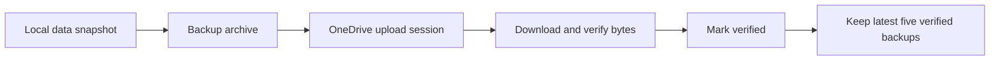

# How OneDrive Backup Works

OneDrive is the active cloud backup provider in Valnook 0.0.15. The Android app creates a complete local backup archive and uploads it directly to the signed-in user's OneDrive. Backups are snapshots for recovery, not continuous synchronization between devices.

## Platforms and components

| Component | Role |
| --- | --- |
| Android app | Starts authorization, creates archives, uploads and downloads files, and restores local data. |
| Microsoft Entra / Microsoft identity platform | Provides application registration, user sign-in, and delegated consent. |
| Microsoft Authentication Library for Android (MSAL) | Handles browser-based sign-in, its token cache, silent token acquisition, and local sign-out. |
| Microsoft Graph v1.0 | Provides the user-profile and OneDrive file APIs. |
| OneDrive | Stores backup archives and their verification metadata in the application's dedicated folder. |
| Android WorkManager | Schedules automatic backups subject to network availability and Android background-execution limits. |

The authentication configuration allows personal Microsoft accounts and work or school accounts. Access still depends on the account having OneDrive available and any applicable organization policies. The implementation uses the global Microsoft Graph endpoint; it does not select national-cloud endpoints or expose a separate SharePoint-site picker.

The LAN web interface does not perform cloud authorization or receive cloud access tokens. No Valnook-operated server relays the backup files. Signing in with an Outlook email address uses a Microsoft account; no Outlook mail API is involved.

## Permissions and application registration

The app requests these delegated Microsoft Graph scopes:

| Scope | Actual use |
| --- | --- |
| `Files.ReadWrite.AppFolder` | Read, create, update, and remove backup files within the application's OneDrive folder. |
| `User.Read` | Call `/me` to display the connected account's name and email address. This permission is used by the current implementation. |

The app-folder permission confines file access to the application's folder rather than granting access to the user's entire drive. See Microsoft's [app-folder documentation](https://learn.microsoft.com/en-us/graph/onedrive-sharepoint-appfolder).

An Android public-client registration supplies the client identifier and a redirect configuration matching the Android package and signing certificate. Debug and release builds must match their respective registered signing identities. The app does not use a client secret. This document deliberately omits deployment identifiers, certificate hashes, signing material, and actual redirect values. The general registration process is described in Microsoft's [Android integration guide](https://learn.microsoft.com/en-us/entra/identity-platform/tutorial-mobile-app-android-prepare-app).

## Connection workflow

- The user chooses to connect OneDrive in the Android backup screen.
- MSAL opens the browser-based Microsoft sign-in and consent flow. The app uses a single-account MSAL client; broker-based authentication is not enabled in this configuration.
- MSAL returns a short-lived access token and account identity. The app calls Graph `/me` to obtain the account display information.
- The app resolves `/me/drive/special/approot`, then finds or creates `Valnook_backup` underneath it. It resolves the special folder through Graph rather than assuming a localized filesystem path.
- The app saves the provider, account reference, folder reference, and backup status locally. Business code does not persist the access token in its backup-state tables; MSAL manages its own authentication cache.
- The backup list is refreshed. Connecting or reconnecting leaves automatic backups disabled until the user enables them.

Later operations request a token silently for the same account. If interaction is required, the app asks the user to reconnect instead of opening sign-in from a background worker.

## Creating, uploading, and verifying a backup



- **Prepare:** Check the active data session, cloud connection, network, and trusted time. Time comes from Android's network clock, with an authenticated Graph response's `Date` header as a fallback. Create a `.val_backup` archive in private temporary storage using the same portable-data format as local backups.
- **Record the attempt:** Assign backup and attempt identifiers and persist the archive size and SHA-256 checksum. Session, connection, and schedule generations prevent an outdated operation from continuing after a relevant state change.
- **Create remote storage:** Under `Valnook_backup`, create a directory named after the backup identifier. Write `metadata.json` before uploading the archive so that a completed upload can be located if the final response is lost.
- **Upload:** Create an upload session for `snapshot.val_backup`. Send sequential chunks of 3,276,800 bytes, with a smaller final chunk where necessary, using `Content-Range`. The returned upload URL is preauthenticated; the app does not attach the Graph bearer token to chunk uploads. This follows the [Graph upload-session protocol](https://learn.microsoft.com/en-us/graph/api/driveitem-createuploadsession?view=graph-rest-1.0).
- **Verify:** Read the uploaded file's metadata and download its bytes to calculate SHA-256 and count the size. The app also checks the file's version. A successful upload response alone does not establish a verified backup.
- **Publish success:** Recheck the bytes before marking the backup verified. Update `metadata.json` with the archive identity and ETag, then reread the metadata. A later archive-version mismatch makes the backup unverified again.
- **Apply retention:** Keep the five newest verified managed backups, ordered by remote creation time. Cleanup removes only the known archive and metadata files from eligible backup directories, using version checks. It leaves empty directories and refuses cleanup when unexpected contents are present. Cleanup failure is reported separately from a successful new backup.

The remote layout is:

```text
Application folder resolved through approot/
  Valnook_backup/
    {backup-id}/
      snapshot.val_backup
      metadata.json
```

Metadata records backup identity, archive checksum, snapshot time, format and producer versions, and verification state. It is not an additional copy of the financial records.

## APIs called

Graph paths below are relative to `https://graph.microsoft.com/v1.0`. Braced names are placeholders, not deployment values.

| Method and endpoint | Purpose |
| --- | --- |
| `GET /me?$select=id,displayName,mail,userPrincipalName` | Display the connected account. |
| `GET /me/drive/special/approot` | Resolve the application's OneDrive folder. |
| `GET /me/drive/special/approot?$select=id` | Obtain the HTTPS response time when needed. |
| `GET /drives/{drive}/items/{parent}:/{name}` | Find the backup root or an individual backup directory. |
| `POST /drives/{drive}/items/{parent}/children` | Create a missing directory with conflict handling. |
| `GET /drives/{drive}/items/{folder}/children` | List backup directories or inspect directory contents; follow Graph pagination. |
| `GET /drives/{drive}/items/{directory}:/snapshot.val_backup` | Locate the uploaded archive. |
| `GET /drives/{drive}/items/{item}` | Check archive identity, parent relationship, size, and ETag. |
| `PUT /drives/{drive}/items/{directory}:/metadata.json:/content` | Create or update backup metadata. |
| `GET /drives/{drive}/items/{directory}:/metadata.json:/content` | Read backup metadata. |
| `POST /drives/{drive}/items/{directory}:/snapshot.val_backup:/createUploadSession` | Start archive upload. |
| `PUT {uploadUrl}` | Transfer sequential archive chunks. |
| `GET /drives/{drive}/items/{archive}/content` | Download for verification, local saving, or restoration. |
| `GET {downloadUrl}` | Follow a content redirect over HTTPS without forwarding the Graph token. |
| `DELETE /drives/{drive}/items/{item}` | Remove eligible older archive and metadata files during retention cleanup. |

Authentication calls use MSAL's `signIn`, `signInAgain`, `acquireTokenSilent`, and `signOut`. OAuth requests and token refresh are handled by MSAL rather than a custom token endpoint implementation.

## Listing, downloading, and restoring

- Listing reads the backup directories and their metadata. Incomplete, unrelated, or invalid items are not accepted as managed restore points. The app checks archive ancestry and does not trust a file reference supplied by the UI alone.
- Saving an original archive downloads it to the destination chosen through Android's document picker. Downloading a file does not restore it.
- Restoring first checks compatibility, downloads to private staging storage, and compares the archive size and SHA-256 with the remote metadata.
- The shared restore pipeline validates the archive manifest, supported features, checksums, data limits, and record relationships, then presents a preview and requires explicit overwrite confirmation.
- A successful restore replaces the local portable dataset in a database transaction; it does not merge two ledgers. Validation failure or transaction rollback preserves the existing data.
- Successful restoration leaves card backs empty and invalidates old private-card associations. Failed restoration preserves existing private content. Automatic cloud backups pause after restoration until the user explicitly resumes them.

## Automatic backups and failure handling

- The default interval is 24 hours; supported intervals are 1–720 hours. WorkManager schedules network-constrained one-time work for the next cycle, so execution is not an exact wall-clock alarm.
- Workers reject stale data, connection, and schedule generations. Demo sessions and maintenance or web-management restrictions are respected.
- Waiting for network or trusted time can be retried before upload begins. A failed upload is not automatically replayed as a new upload in the same cycle.
- An uncertain upload result is recorded separately. On a later attempt, the app searches for the existing attempt and verifies its bytes before deciding whether it can reuse that result. It does not assume a lost response means the remote file is absent.
- Graph throttling receives a bounded retry using `Retry-After`. Authorization, quota, permission, verification, and cleanup failures are exposed as distinct states.

## Disconnecting and data boundaries

Disconnecting clears the local cloud connection, cancels scheduled work, invalidates in-flight generations, and signs out of the local MSAL client. It does not delete existing OneDrive backups. Removing the server-side grant is a separate action through Microsoft's account consent-management page or organizational My Apps portal.

The archive contains the explicitly supported financial records, account icons, wallet fronts, card links, ordering, and portable settings. It excludes OAuth tokens, authentication caches, Android Keystore keys, and all private card-back content: card numbers, expiry dates, CVVs, back/edge colors, encrypted vault files, and their local-only associations.

The `.val_backup` archive is **not encrypted by Valnook**. HTTPS protects transfers; checksum verification checks consistency and is not encryption or a digital signature. A person with access to the archive can read its included data. See the [Privacy Policy](PRIVACY_POLICY_EN.md).

For implementation details, see [MicrosoftAuthorizationGateway](../app/src/main/java/dev/valnook/app/cloud/MicrosoftAuthorizationGateway.kt), [OneDriveRestApi](../core/data/src/main/kotlin/dev/valnook/data/cloud/OneDriveRestApi.kt), [CloudBackupCoordinator](../core/data/src/main/kotlin/dev/valnook/data/cloud/CloudBackupCoordinator.kt), and [BackupContract](../core/data/src/main/kotlin/dev/valnook/data/portability/BackupContract.kt).
