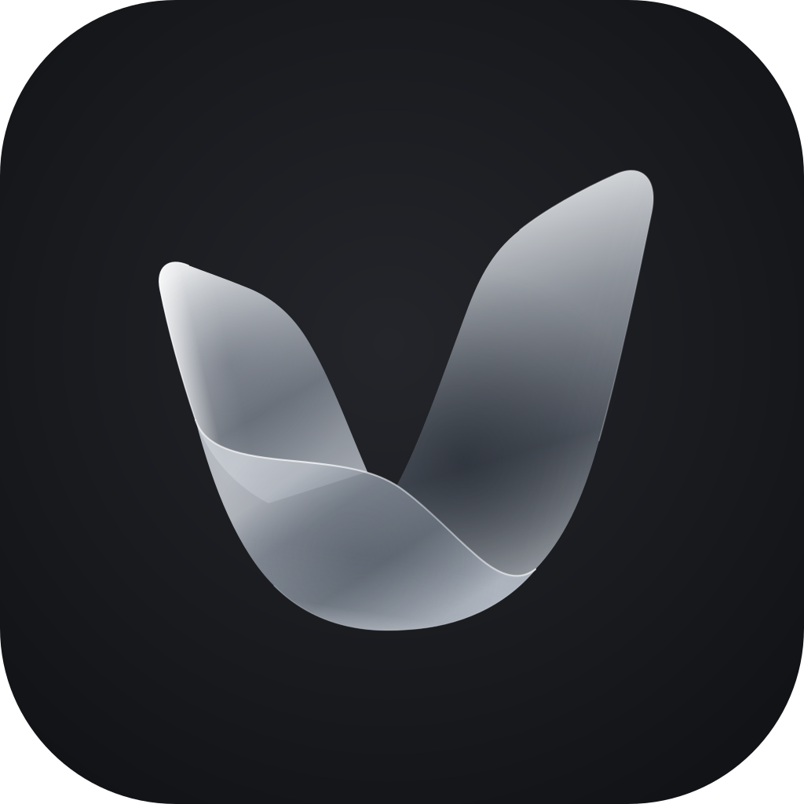
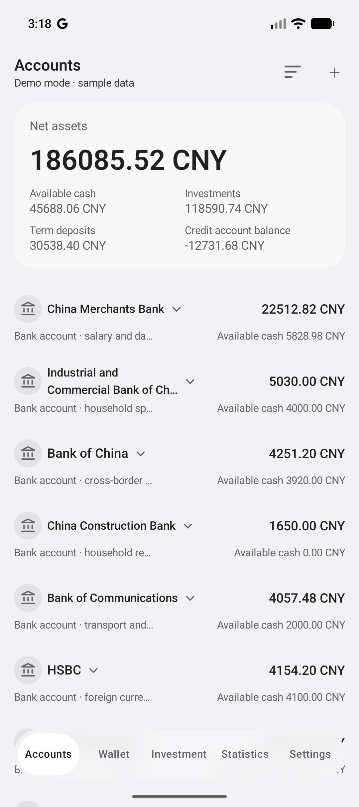
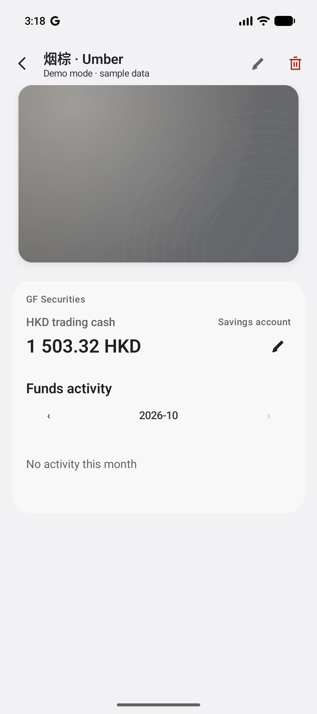
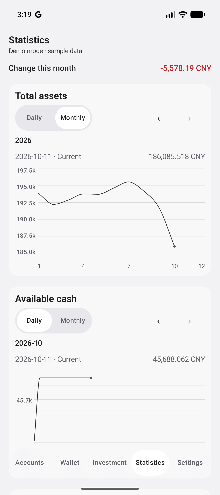

  

<h1 align="center">Valnook</h1>

A local-first Android app for personal financial records and asset management.

<strong>Version 0.0.15</strong> · <a href="../LICENSE">MIT License</a>

English · <a href="README_CN.md">简体中文</a>

## About

Valnook brings savings, credit accounts, term deposits, and investment records together so you can track your assets, liabilities, and changes over time. Data is stored on your device, with no account registration required.

## Features

| Feature | Description |
| --- | --- |
| Accounts | Organize savings and credit subaccounts by main account and currency. Record balances and fund activity, and view credit limits, statement dates, and payment due dates. |
| Term deposits | Record principal, term, and interest rate; manage opening and closing deposits. |
| Investments | Record holdings and trades, update valuations, and view market value and profit/loss. |
| Statistics | View assets by account, asset type, and currency, with daily and monthly history. |
| Wallet | Import card images and organize cards. Link a subaccount to view its balance, credit limits, and monthly fund activity. Store card numbers, expiry dates, and CVVs locally with encryption. |
| Web management | Pair your phone with a computer on the same local network to manage accounts and financial records from a browser. |
| Backup and export | Create and restore local backups, back up data to OneDrive, or export to Excel. Private card-back information is excluded from backups and exports. |
| Personalization | English and Chinese, light and dark themes, custom account icons and navigation, and a demo mode for trying the app. |

<table>
  <tr><th>Accounts</th><th>Card details</th><th>Statistics</th></tr>
  <tr>
    <td></td>
    <td></td>
    <td></td>
  </tr>
</table>

## Project structure

| Module | Responsibility |
| --- | --- |
| `app` | Application startup, navigation, dependency wiring, and data sessions. |
| `core:domain` | Data models, financial rules, and repository interfaces. |
| `core:data` | Local storage, repository implementations, backup/restore, and the local web server. |
| `core:designsystem` | Shared themes and UI components. |
| `feature:*` | Accounts, cash, deposits, investments, wallet, statistics, settings, backup, and web management screens. |

## Implementation

- **Android UI:** Kotlin, Jetpack Compose, and Material 3; ViewModels and coroutine flows manage screen state. Hilt provides application-level dependency injection, and Navigation 3 handles navigation.
- **Data:** Room stores financial records locally. Financial rules are separate from storage and UI.
- **Web management:** Bundled HTML, CSS, and JavaScript connect to the phone's embedded Ktor server over HTTP/WebSocket after pairing on the same local network.
- **Private information:** Card-back fields use AES-GCM with keys managed by Android Keystore and are stored separately from data eligible for backup.

## Privacy

Cloud backup is optional. Private card-back data stays on the device and is unavailable to web management or backup recovery. Card-front images are included in full backups. Backup and Excel files are not encrypted; keep them safe. Use web management only on trusted networks and devices, as its connection is not encrypted.

See the [Privacy Policy and Disclaimer](PRIVACY_POLICY_EN.md) for details. [简体中文](PRIVACY_POLICY_CN.md).

## Attention

Valnook provides recording, calculation, and presentation tools. It does not provide investment or other professional advice. Independently verify all data and calculations.

**To the fullest extent permitted by applicable law, the authors and copyright holders are not liable for financial loss arising from the use of or inability to use this software.** See the [privacy policy and disclaimer](PRIVACY_POLICY_EN.md) and [MIT License](../LICENSE).
