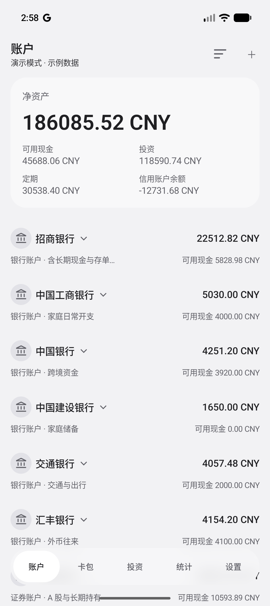
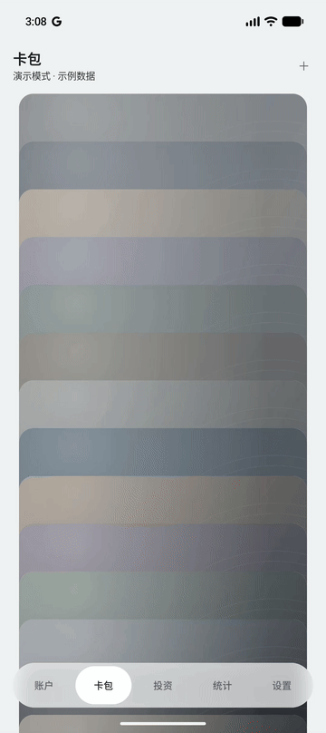
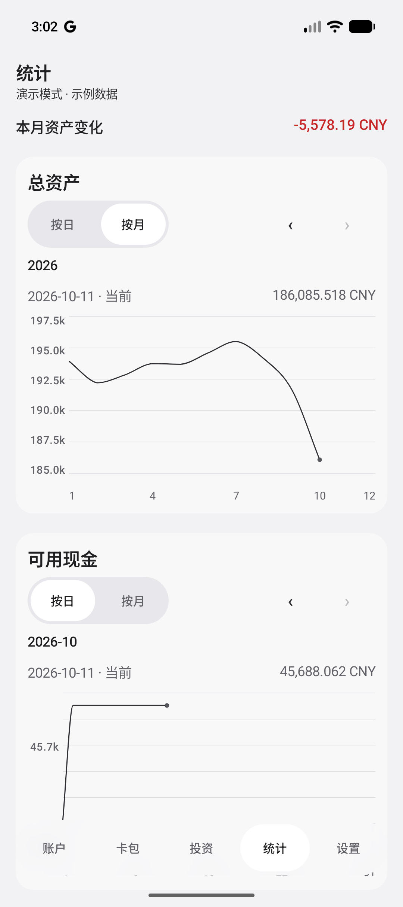

  

<h1 align="center">Valnook</h1>

一款以本地存储为主的 Android 个人财务记录与资产管理应用。

<strong>版本 0.0.15</strong> · <a href="../LICENSE">MIT 许可证</a>

<a href="../README.md">English</a> · 简体中文

## 用途

Valnook 帮助您集中管理储蓄、信用账户、定期存款和投资记录，了解资产构成、负债及资产变化。数据保存在本机，无需注册账户。

## 主要功能

| 功能 | 说明 |
| --- | --- |
| 账户管理 | 按主账户管理不同币种的储蓄、信用子账户，记录余额与资金变动，查看信用额度、出账日和还款日提示。 |
| 定期存款 | 记录存款本金、期限和利率，管理定期存款的开立与结清。 |
| 投资管理 | 记录投资持仓和交易，更新估值，查看市值与盈亏。 |
| 资产统计 | 汇总不同账户、资产类型和币种的资产，按日或按月查看资产变化。 |
| 卡包 | 导入卡面图片、整理卡片；绑定子账户后，可查看余额、信用额度及每月资金变动。支持在本机加密保存卡号、有效期和 CVV。 |
| 网页管理 | 手机与电脑处于同一局域网时，配对后可通过电脑浏览器管理账户与财务记录。 |
| 备份与导出 | 创建和恢复本地备份，使用 OneDrive 备份数据，或导出为 Excel 文件。卡背私密信息不包含在备份和导出中。 |
| 个性化 | 支持中英文、深浅色主题、账户图标和导航栏自定义，可通过演示模式体验功能。 |

<table>
  <tr><th>账户</th><th>卡片详情</th><th>统计</th></tr>
  <tr>
    <td></td>
    <td></td>
    <td></td>
  </tr>
</table>

## 项目架构

| 模块 | 职责 |
| --- | --- |
| `app` | 应用启动、导航、依赖装配和数据会话管理。 |
| `core:domain` | 数据模型、财务计算规则和数据访问接口。 |
| `core:data` | 本地存储、数据访问实现、备份恢复和本地网页服务。 |
| `core:designsystem` | 共用主题与 UI 组件。 |
| `feature:*` | 账户、资金、定期、投资、卡包、统计、设置、备份和网页管理页然后面。 |

## 实现方式

- **Android 界面：** 使用 Kotlin、Jetpack Compose 和 Material 3，通过 ViewModel 与协程 Flow 管理页面状态；Hilt 负责应用级依赖注入，Navigation 3 负责导航。
- **数据管理：** 使用 Room 在本地保存财务记录，财务计算规则与存储、界面分离。
- **网页管理：** 随应用打包 HTML、CSS 和 JavaScript，通过手机内嵌的 Ktor 服务提供同一局域网内配对后的 HTTP/WebSocket 访问。
- **私密信息：** 卡背字段使用 AES-GCM 加密，密钥由 Android Keystore 管理，与可备份的数据分开保存。

## 隐私

云备份由用户选择启用。卡背私密数据仅保存在本机，不能通过备份恢复，网页端也无法访问；卡面图片会包含在完整备份中。备份和 Excel 文件本身不加密，请妥善保管。网页管理连接不提供传输加密，请仅在可信网络和设备上使用。

详细说明见[隐私政策与免责声明](PRIVACY_POLICY_CN.md)。[English](PRIVACY_POLICY_EN.md)。

## 文档

- [OneDrive 备份工作流程（英文）](ONEDRIVE_BACKUP.md)
- [Google Drive 备份旧实现说明（英文，暂未启用）](GOOGLE_DRIVE_BACKUP.md)
- [完整更新日志（英文）](CHANGELOG.md)

## Attention / 注意

Valnook 仅提供记录、计算与展示工具，不构成投资或其他专业建议。请自行核对数据和计算结果。

**在适用法律允许的最大范围内，作者及版权持有人不对因使用或无法使用本软件而产生的财务损失承担责任。** 详见[隐私政策与免责声明](PRIVACY_POLICY_CN.md)及 [MIT 许可证](../LICENSE)。
